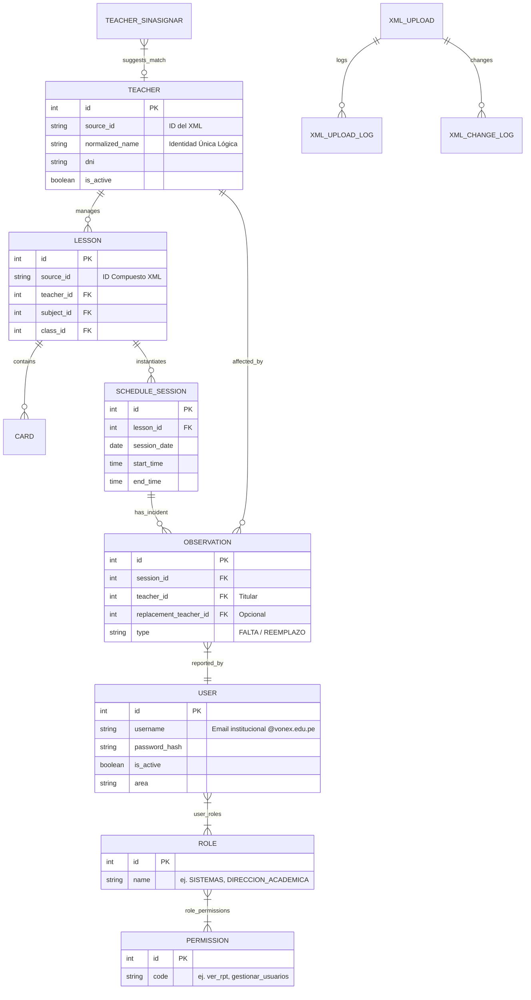
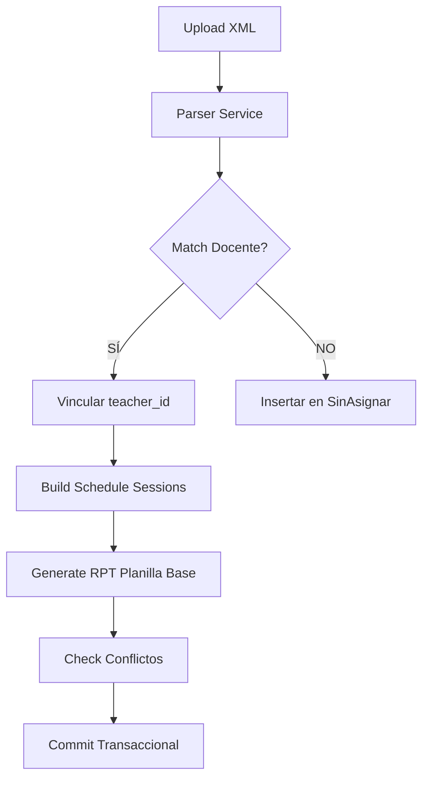
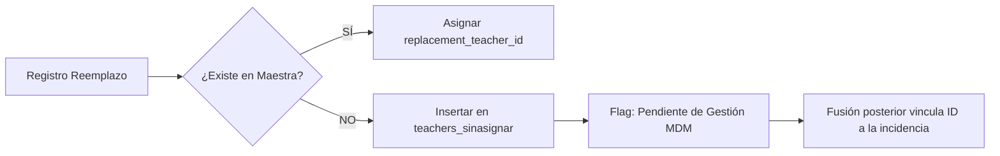
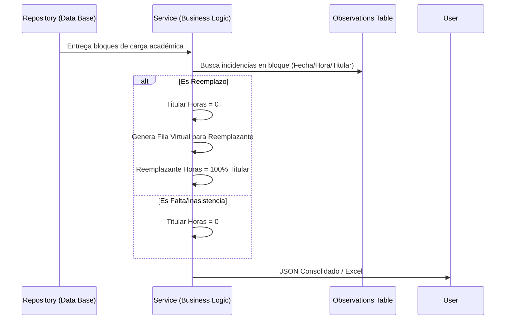

# Documentación Técnica Maestra (ARCHITECTURE.md)
**Proyecto:** Sistema de Gestión Académica (Schedule Management Service)
**Perfil:** Auditor Senior / Technical Lead
**Versión:** 1.1 (Ajuste Post-Auditoría)

---

## 1. Resumen Ejecutivo
El **Schedule Management Service** es un sistema empresarial diseñado para orquestar la carga académica (horarios), el registro de incidencias reales (observaciones) y la liquidación de horas dictadas (planillas de pago). Su principal valor radica en la conciliación dinámica entre los horarios teóricos (importados de XML aSc Horarios) y la realidad operativa de la institución.

---

## 2. Stack Tecnológico
*   **Backend:** FastAPI (Python 3.10+) - *High performance asynchronous API*.
*   **Base de Datos:** PostgreSQL (Relacional) + SQLAlchemy (ORM). Uso de `JSONB` para logs de auditoría.
*   **Reportes:** Pandas & Openpyxl (Lógica de exportación binaria).
*   **Algoritmo de Identidad:** RapidFuzz / Difflib para Fuzzy Matching de docentes.
*   **Frontend:** Monolito HTML5/Vanilla JS/CSS3 (Prototype SPA).

---

## 3. Estructura del Proyecto
El sistema implementa una arquitectura modular adaptada de **Domain-Driven Design (DDD)** simplificado.

```text
app/
├── modules/
│   ├── docentes/           # MDM: Maestra de Docentes, Normalización, Fuzzy.
│   ├── observaciones/      # Incidencias: Faltas, Reemplazos, Agrupación.
│   ├── horarios/           # Horarios: Motor de importación XML y Grillas.
│   ├── reportes/           # RPT: Generación de planillas (Lógica Binaria).
│   ├── configuracion/      # Settings: Recesos, Almuerzos.
│   └── auditoria/          # Logs: Trazabilidad de cambios (JSONB).
├── services/               # Servicios transversales (XML Parsing, Conflict Validation).
├── models.py               # Definición global de entidades (SQLAlchemy).
├── database.py             # Configuración de conexión y motor.
└── main.py                 # Punto de entrada y orquestación de routers.
```

---

## 4. Modelo de Datos (ERD)



### 4.1 Descripción de Entidades Principales

*   **TEACHER**: Representa la maestra oficial de docentes. Su ancla de identidad no es solo el `id`, sino el `normalized_name`, que permite el cruce con fuentes externas (XML/Excel).
*   **LESSON (Entidad Nodo)**: Es el eje central del horario. Vincula un **Docente**, un **Curso** (Subject) y una **Sección/Aula** (ClassGroup). Sin una `Lesson`, no existen sesiones de clase. Actúa como el "contrato" de carga académica.
*   **SCHEDULE_SESSION**: La instancia física de una `Lesson` en el calendario. Es donde ocurren las incidencias. Cada registro representa un bloque horario específico (ej. Lunes 08:00 - 08:50).
*   **OBSERVATION**: Registro de lo que ocurrió realmente en una sesión. Soporta tipos como FALTA (descuento) y REEMPLAZO (pago a tercero).
*   **TEACHER_SINASIGNAR**: Tabla de *staging* para docentes detectados en el XML que no figuran en la maestra. Implementa lógica de "posible duplicado" mediante fuzzy matching.
*   **USER / ROLE / PERMISSION (RBAC)**: Eje de seguridad. Los usuarios (emails de Vonex) obtienen accesos a la API según sus roles y permisos asignados de forma granular.

---

## 4.5 Módulo de Autenticación y Autorización (JWT + RBAC)

El sistema integra seguridad robusta mediante `OAuth2PasswordBearer` con tokens JWT.

### Autenticación
*   **Dominio Restringido**: En el servicio de creación y en el login, se valida estrictamente que todos los usuarios pertenezcan al dominio `@vonex.edu.pe`.
*   **Hash Seguro**: bcrypt previene la exposición de contraseñas.
*   **JWT Payload**: El campo `sub` estandariza el transporte temporal del `user_id` asegurando la identidad del portador.

### Autorización (Bypass & Permisos)
Inyectado como dependencias FastApi (`get_current_active_user` y `require_permission(code)`).
*   **Flujo General**: Cuando un usuario invoca un endpoint protegido, su árbol de roles se extrae eagermente (`joinedload`), evitando N+1 queries. Se contrastan los códigos de los permisos requeridos por el recurso.
*   **Bypass Case-Insensitive**: Existencia de permisos comodín. Si el perfil porta el rol `SISTEMAS` o `SUPERADMIN`, evade la comprobación granular y obtiene acceso total a cualquier recurso.

#### Mapa de Permisos Críticos Actuales:
*   `ver_rpt` y `exportar_rpt` (Módulo Reportes)
*   `subir_xml` y `ver_horarios` (Módulo Horarios)
*   `crear_observaciones` y `editar_observaciones` (Módulo Incidencias)
*   `gestionar_docentes` y `gestionar_configuracion` (Módulos Backend/Setup)

---

## 5. Master Data Management (MDM) - Docentes

### 5.1 Algoritmo de Normalización
Ubicado en `app/modules/docentes/service.py:25`.
1.  **Lowering:** Todo a minúsculas.
2.  **Acents:** Eliminación de tildes mediante normalización `NFKD`.
3.  **Clean:** Eliminación de comas y caracteres especiales.
4.  **Colapso:** Espacios múltiples se reducen a uno solo (`trimmed`).

### 5.2 Motor Fuzzy Matching (v3.2)
*   **Threshold:** 90.0% de similitud.
*   **Optimización:** Filtrado previo por prefijo (2 caracteres) y longitud de cadena (±20%).
*   **Propósito:** Evitar duplicidad cuando un docente viene en el XML con variaciones (ej. "Tello, Javier" vs "Javier Tello").

### 5.3 Staging: Teachers SinAsignar
Un docente detectado en el XML que no coincide en `Teacher.normalized_name` entra en estado de **Staging**.
1.  **Detección:** Si el match exacto falla, entra a `teachers_sinasignar`.
2.  **Promoción:** El administrador puede "Promover" a la maestra o "Fusionar" con uno existente.
3.  **Vinculación Retrospectiva:** Al promover, el sistema busca incidencias huérfanas por nombre y les asigna el nuevo `teacher_id`.

---

## 6. Flujos Críticos de Negocio

### 6.1 Ingesta Masiva XML


### 6.2 Flujo de Incidentes y Docentes Nuevos
Cuando se registra un reemplazo de un docente que no está en la maestra:



### 6.3 Lógica Binaria de Reportes (RPT)
La generación de planillas no es una simple consulta; es un proceso de **reajuste dinámico**.



---

## 7. Catálogo Completo de Endpoints API

### 7.1 Módulo: Docentes (`/api/docentes`)
*   `GET /`: Lista maestra de docentes (Filtros: acts, inacts, all).
*   `POST /`: Registro manual de docente.
*   `PUT /{id}`: Actualización de datos maestros.
*   `PATCH /{id}/estado`: Activar/Desactivar docente (Regla v3.10).
*   `POST /import-excel`: Carga masiva MDM desde Excel.
*   `POST /reprocesar-historico`: Re-normalización masiva de la BD.
*   `POST /fusionar`: Fusión atómica de dos docentes.
*   `GET /sinasignar`: Lista de docentes en tránsito (staging).
*   `POST /sinasignar/{id}/promote`: Elevación de temporal a maestro.

### 7.2 Módulo: Observaciones (`/api/schedule`)
*   `GET /observations`: Consulta de incidencias por rango/docente.
*   `POST /observations`: Creación/Actualización de FALTA o REEMPLAZO.
*   `DELETE /observations/{id}`: Eliminación de incidencia.
*   `GET /sessions-for-obs`: Obtiene bloques de sesiones agrupadas para registro.

### 7.3 Módulo: Horarios (`/api/schedule`)
*   `POST /upload`: Importación de archivo XML aSc Horarios.
*   `GET /xml-uploads`: Historial de cargas realizadas.
*   `GET /teacher/{id}`: Grilla de horarios por docente.
*   `GET /classroom/{id}`: Grilla de horarios por aula.
*   `GET /export`: Exportación de grillas a Excel.

### 7.4 Módulo: Reportes (`/api/rpt-planilla`)
*   `GET /`: Generación dinámica de planilla (Lógica Binaria).
*   `GET /sedes`: Lista de sedes detectadas.
*   `GET /aulas`: Lista de aulas por sede.
*   `GET /export`: Generación de archivo Excel de pago.

---

## 8. Decisiones Arquitectónicas (ADR)

*   **ADR 001: Normalized Name como Clave Lógica:**
    *   *Contexto:* El XML no garantiza DNI. 
    *   *Decisión:* Se usa el nombre normalizado como puente de identidad entre XML, Excel e Incidencias.
*   **ADR 002: Lógica Binaria en Capa de Aplicación:**
    *   *Contexto:* Las incidencias no deben mutar la carga académica base.
    *   *Decisión:* El cálculo de horas 0/100 se hace en caliente (Service) y no se persiste, permitiendo auditoría de "lo que debió ser" vs "lo que fue".
*   **ADR 003: Deduplicación Visual en UI:**
    *   *Contexto:* Un bloque de 3 horas académicas son 3 registros en BD.
    *   *Decisión:* El `service` agrupa por curso/día/docente para el usuario final.

---

## 9. Matriz de Riesgos Técnicos

| Riesgo | Probabilidad | Impacto | Mitigación |
| :--- | :---: | :---: | :--- |
| **Colisión de `normalized_name`** | Baja | Muy Alto | Implementar validación cruzada con DNI en el proceso de Importación Excel. |
| **Duplicidad XML/Maestra** | Media | Alto | Uso estricto de `teachers_sinasignar` y fusiones transaccionales. |
| **Dependencia de Normalización** | Alta | Medio | El algoritmo de normalización es central; cualquier cambio requiere re-procesamiento masivo de la BD. |
| **Inconsistencia temporal RPT** | Baja | Medio | Las sesiones deben tener integridad de segundos para mapear correctamente con el RPT original. |

---

## 10. Limitaciones Actuales
1.  **Reglas de Recesos Estáticas**: La lógica de 0.33 horas está atada a horarios fijos (9:40, 10:30) en el código.
2.  **Frontend Monolítico**: El archivo `index.html` centraliza toda la lógica de presentación, dificultando el mantenimiento a largo plazo.
3.  **Validación de DNI**: No todos los docentes XML tienen DNI, lo que debilita el MDM frente a homónimos perfectos.

---

## 11. Observaciones del Auditor

> [!IMPORTANT]
> **Calidad del Código:** El sistema presenta una separación de capas madura. El repositorio de Docentes es particularmente robusto en su lógica de búsqueda.
>
> **Oportunidad de Mejora:** Se recomienda migrar la lógica de recesos a un `CalculatorService` configurable para soportar diferentes turnos y sedes sin modificar el Core del servicio.
