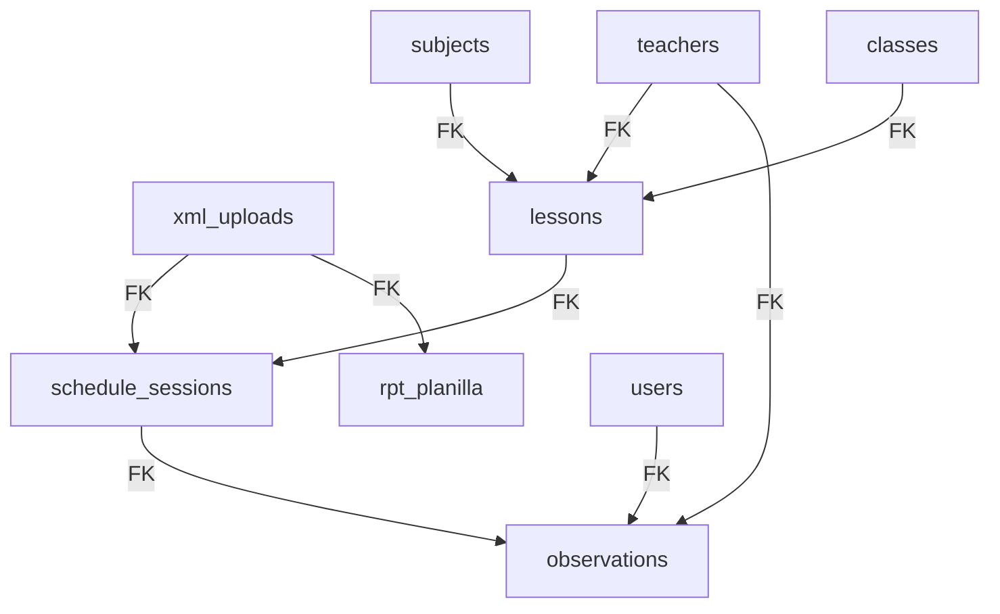

# Academic Dependency Matrix

This document outlines the strict foreign key dependency flow and cascade rules of the academic tables in the VONEX Schedule Management System, which dictates the safe delete order for test data.

## 1. Table Relations Flow

## 2. Dependency Hierarchy & Operational Cleanup Actions

Below is the cleanup sequence required to safely remove test records without violating foreign keys:

| Sequence | Entity / Table | Delete Condition | Target Records | Cascading Impact / Mitigation |
| :---: | :--- | :--- | :--- | :--- |
| **1** | **observations** | Linked to sessions with non-historical `xml_upload_id` or matching test user. | Test/fixture observations | **None**. Leaves parent sessions intact. |
| **2** | **rpt_planilla** | `xml_upload_id` is NOT `8bc2c3a5-fa43-4cb2-8971-ebd07ccb5b84`. | Test payroll consolidated lines | **None**. |
| **3** | **schedule_sessions** | `xml_upload_id` is NOT `8bc2c3a5-fa43-4cb2-8971-ebd07ccb5b84`. | Test schedule sessions | Breaks reference to `lessons`. We must clear sessions first. |
| **4** | **lessons** | Not referenced by any remaining `schedule_sessions` AND linked to test courses/classes. | Temporary lessons | Prevents orphan records. |
| **5** | **teachers** | `id` is NOT in the historical teachers backup list. | Seed/fixture teachers | Leaves real historical teachers untouched. |
| **6** | **classes** | `id` is NOT in the historical classes backup list. | Temporary classrooms | Cleans up test fixtures. |
| **7** | **subjects** | `id` is NOT in the historical subjects backup list. | Temporary course cards | Cleans up test fixtures. |
| **8** | **xml_uploads** | `id` is NOT `8bc2c3a5-fa43-4cb2-8971-ebd07ccb5b84` (historical virtual). | Test XML uploads | Final clean of upload logging context. |

## 3. Strict Preserved Tables (FORBIDDEN PATHS)

The following tables are **NEVER** modified, truncated, or touched during this academic test reset:
* **`users`**: Administrative profiles and usernames are kept secure.
* **`roles`**, **`permissions`**, **`user_roles`**, **`role_permissions`**: Complete RBAC security layout is fully preserved.
* **`recess_rules`**: Break configurations and deduct parameters are left fully untouched.
* **`audit_logs`**: System auditing logs are fully preserved for security traceability.
