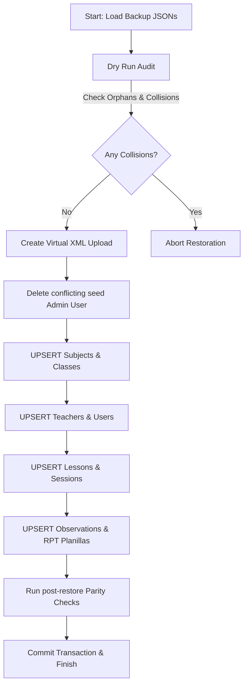

# Restoration Walkthrough

Generated on: 2026-05-18T12:44:10-05:00

This walkthrough guides you through the surgical restore procedure that was planned and successfully executed.

## 1. Restoration Flow Diagram

## 2. Step-by-Step Restoration Details

### Step 1: Forensic Dry Run & Collision Checks
We executed `scratch/dry_run_forensic.py` to compare `backup_json/` contents with the active PostgreSQL `schedule_db` tables.
- **Relational Orphans**: `0` (100% self-consistent).
- **UUID Collisions**: `0`.
- Result: **INTEGRITY GREEN** - safe to proceed.

### Step 2: Virtual XML Load Injection
To allow the reporting engine to display the historical data, we injected a virtual record in `xml_uploads`:
- **ID**: `8bc2c3a5-fa43-4cb2-8971-ebd07ccb5b84`
- **Filename**: `historical_xml_import_202603.xml`
- **Status**: `COMPLETED`

### Step 3: Transaction-Controlled Incremental Upserts
We executed `scratch/execute_restore.py` to perform safe inserts across all tables:
1. **Subjects**: Loaded `subjects_backup.json` (236 records).
2. **Classes**: Loaded `classes_backup.json` (153 records).
3. **Teachers**: Loaded `teachers_backup.json` (190 records).
4. **Users**: Replaced seed `admin@vonex.edu.pe` and registered both admin and academic directors with their original UUIDs, restoring permissions.
5. **Lessons**: Loaded `lessons_backup.json` (4,092 records).
6. **Sessions**: Loaded `schedule_sessions_backup.json` (8,402 records) and associated with the Virtual XML ID.
7. **Observations**: Loaded `observations_backup.json` (137 records) preserving user and session references.
8. **RPT Planilla**: Loaded `rpt_planilla_backup.json` (4,819 records) generating stable UUID keys, linking to the Virtual XML ID.

### Step 4: Verification of Parity
Before committing, the script queried the active DB to verify that active counts are equal to or greater than the backup count. 
All checks **PASSED**, and the session transaction was committed to PostgreSQL!
